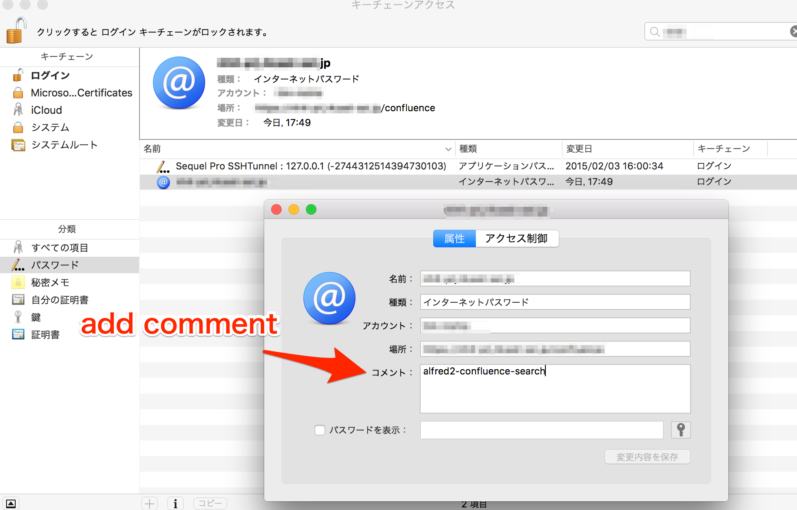

# Alfred2 Confluence Search

Alfred2 Confluence search for myself.

# Installation

1. Clone this repo.
2. Go into your keychain, and create an item as below.
3. open alfred2-confluence-search.alfredworkflow and import this program to your alfred2.
4. ready to go.

# Keychain settings

Step1. Open keychain Program

Step2. Add keychain Item (add your confluence url to keychain name)

Step3. Search adding item, and add "alfred2-confluence-search" comment.

Step4. That's all.

## LICENSE:

MIT
